<!-- Animated Header -->
<h1 align="center">
  
</h1>

<!-- Animated Banner -->

<!-- Dynamic Badges -->

  
  
  
  
  

<!-- Quick Links -->

  
  
  
  

---

## 🎯 About Our Journey

**ICPC MNU Community** started in **2023** with a vision to create Egypt's most vibrant competitive programming ecosystem. Today, we're proud to have:

 

<!-- Animated Stats Grid -->

  
  <h3>130+</h3>
  
<b>Active Trainees</b>

  
  <h3>40+</h3>
  
<b>Core Team</b>

  
  <h3>ECPC</h3>
  
<b>Finals Qualified</b>

  
  <h3>Expert+</h3>
  
<b>Codeforces</b>

---

## 👥 Our Team Structure

```mermaid
graph TD
    A[🎯 ICPC MNU Leadership] --> B[👑 President]
    A --> C[📝 Problem Setters]
    A --> D[🎓 Mentors]
    A --> E[🤝 HR Team]
    A --> F[📢 Media Organizers]
    
    B --> B1[Community Strategy<br>🌟 Vision & Growth]
    C --> C1[Contest Creation<br>💡 Problems & Solutions]
    D --> D1[Training Sessions<br>📚 Workshops & Guidance]
    E --> E1[Member Management<br>👥 Recruitment & Support]
    F --> F1[Brand Building<br>📱 Outreach & Content]
```

## 📈 Community Progress

### 🎯 Codeforces Rating Distribution

## 🛠 Tech Stack & Platforms

 

## 🌟 Success Stories

> "From solving my first problem to reaching **Expert on Codeforces** in 6 months - ICPC MNU's structured training made it possible!" 
> *— Community Member*

> "The weekly contests and mentor support helped our team qualify for **ECPC Finals** - a dream come true!"
> *— Competitive Team*

---

### **📞 Connect With Us**

 

